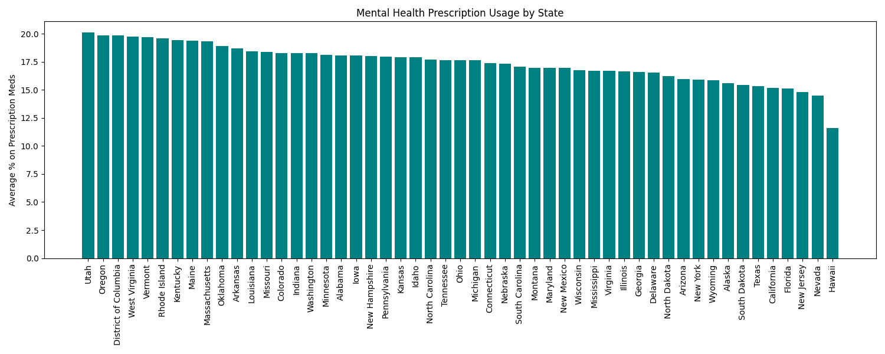
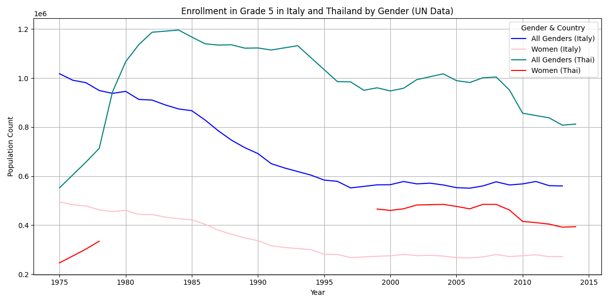

# Project 2 : Visualing Interesting Data Sets

## mental health prescription per state

# This is a chart of the different prescription amounts per state. It shows average % vs the state its in.

Original Data Source:
[Mental Health Care in the Last 4 Weeks](https://catalog.data.gov/dataset/mental-health-care-in-the-last-4-weeks)

## Italy and Thailand plot of enrollment in grade 5

# This is a line graph of the enrollment of students in Italy and Thailand in grade 5. There are four different lines, one for all genders and one for females and it changes by year. We are missing data for thai women enrolled in grade 5 1978 to 1998.

Original Data Source:
[Italy data source](https://data.un.org/Data.aspx?q=italy&d=UNESCO&f=series:E_1_G5;ref_area:ITA&c=2,3,5,7,9,10&s=ref_area_name:asc,time_period:desc&v=1)

[Thai data source](https://data.un.org/Data.aspx?q=Enrolment+in+Grade+5+of+primary+education+thailand&d=UNESCO&f=series%3aE_1_G5%3bref_area%3aTHA)

